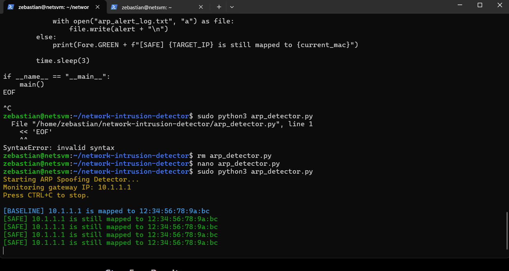
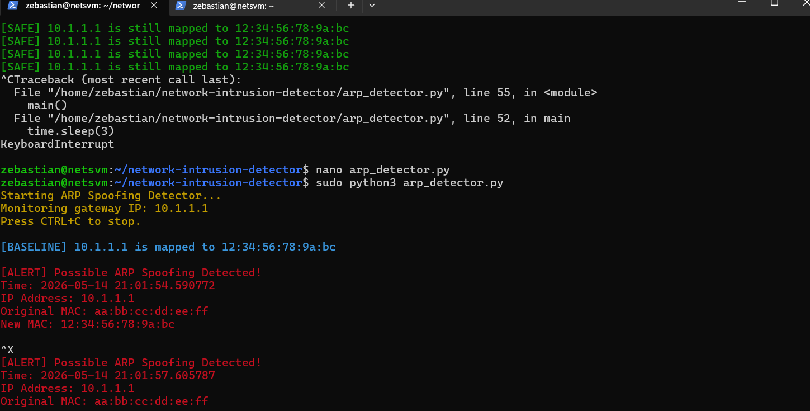

# Network Intrusion Detector

A simple Python project that monitors ARP activity on a local network and alerts the user when a device’s MAC address unexpectedly changes.

This project was created for my Computer Networking final project and focuses on basic network security concepts like ARP spoofing and man-in-the-middle attacks.

---

# What This Project Does

This tool checks the MAC address associated with the network gateway and continuously monitors it for changes.

Normally, a device’s IP address should always map to the same MAC address on a stable local network. If that mapping suddenly changes, it can be a sign of ARP spoofing.

The detector:

* Sends ARP requests to the gateway
* Receives ARP replies
* Stores the original MAC address
* Continuously checks for changes
* Displays alerts if suspicious behavior is detected

---

# Why I Built This

During my networking course, we learned about protocols like ARP, NAT, TCP/UDP, VPNs, and packet analysis. I wanted to build something related to network security that was realistic but still manageable to complete in a small lab environment.

I chose ARP spoofing detection because it demonstrates how devices communicate on a local network and how attackers can abuse ARP to redirect traffic.

---

# Technologies Used

* Python 3
* Scapy
* Colorama
* Ubuntu Linux VM
* GitHub

---

# Features

* Real-time gateway monitoring
* ARP request/reply handling
* MAC address verification
* Alert system for suspicious changes
* Color-coded terminal output
* Alert logging to a text file

---

# Network Topology

The project was tested inside an Ubuntu Linux virtual machine connected to a local virtual network.

The detector monitored communication between the VM and the network gateway/router by sending ARP requests and analyzing ARP replies.

```text
+-------------------+
| Ubuntu VM         |
| ARP Detector Tool |
| IP: 10.1.1.4      |
+-------------------+
          |
          | Local Network
          |
+-------------------+
| Gateway / Router  |
| IP: 10.1.1.1      |
+-------------------+
```
---

# Project Structure

```text
network-intrusion-detector/
│
├── arp_detector.py
├── requirements.txt
├── README.md
├── sample_logs/
│   └── arp_alert_log.txt
└── screenshots/
```

---

# Installation

Clone the repository:

```bash
git clone https://github.com/Zebastiann/network-intrusion-detector.git
cd network-intrusion-detector
```

Install dependencies:

```bash
pip install -r requirements.txt
```

Run the detector:

```bash
sudo python3 arp_detector.py
```

---

# Screenshots

## Baseline Monitoring

The detector establishes a baseline MAC address for the gateway and continuously checks to make sure it does not change.



---

## Simulated ARP Spoofing Alert

To demonstrate the alert system safely in a controlled environment, a simulated spoofing event was used to trigger the warning message.



---

# Educational Purpose

This project was created for educational purposes only inside a controlled virtual machine environment.

No real malicious attacks were performed.

---

# Possible Improvements

Some future improvements I would like to add include:

* Monitoring multiple devices at once
* Desktop notifications
* Better packet logging
* GUI dashboard
* Integration with Wireshark captures
* Email alerts

---

# References:

* Scapy Documentation: https://scapy.readthedocs.io/
* Python Documentation: https://docs.python.org/3/
* GeeksforGeeks ARP Protocol Overview: https://www.geeksforgeeks.org/arp-protocol-packet-format/

# Author

Zebastian Sanchez

GitHub:
[https://github.com/Zebastiann](https://github.com/Zebastiann)
